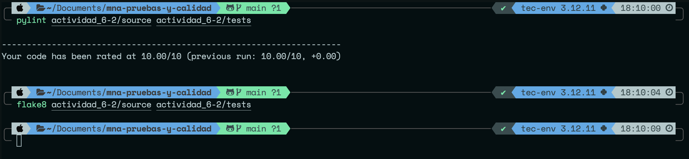
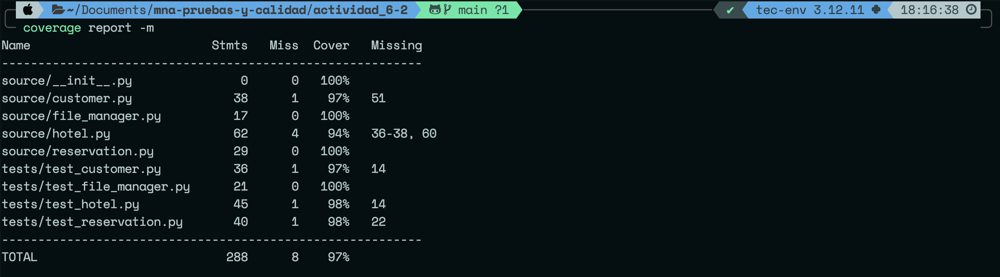

# Sistema de Reservaciones de Hoteles 🏨

Este repositorio contiene la implementación de un sistema de gestión de Hoteles, Clientes y Reservaciones, desarrollado en Python y enfocado en pruebas y calidad de software.

## 📊 Calidad del Código (PEP-8)
El código cumple al 100% con los estándares de PEP-8. Se realizaron análisis estáticos garantizando **cero errores** e implementando buenas prácticas de diseño modular.

**Evidencia de Flake8 y Pylint:**


## 🧪 Pruebas Unitarias y Cobertura
El sistema cuenta con un conjunto de pruebas unitarias que cubren tanto los flujos exitosos como los casos negativos requeridos (manejo de datos inválidos, archivos corruptos, clientes duplicados, etc.). 

Se alcanzó una **cobertura del 97%** (superando el 85% requerido).

**Evidencia de Coverage:**


## 🚀 Cómo ejecutar las pruebas localmente

1. **Ejecutar Pruebas y Medir Cobertura:**
   ```bash
   coverage run -m unittest discover -s tests
   coverage report -m
   ```

2. **Ejecutar Análisis Estático (Linter):**
   ```bash
   flake8 source/ tests/
   pylint source/ tests/
   ```

---

### Arquitectura: DAO vs. POO Tradicional

En este proyecto decidí alejarme del enfoque tradicional de la Programación Orientada a Objetos (como el patrón Active Record), donde una misma clase suele encargarse tanto de sus atributos lógicos como de su propia persistencia (guardar y leer datos de la base).

En su lugar, implementé una arquitectura inspirada en el patrón DAO (Data Access Object), dividiendo el sistema en dos capas distintas:

Capa de Lógica de Negocio (Hotel, Customer, Reservation): Estas clases se encargan exclusivamente de las reglas operativas del sistema (por ejemplo, validar que un hotel tenga disponibilidad antes de restar una habitación). Estas clases "ignoran" por completo cómo o dónde se guarda la información físicamente.

Capa de Persistencia (FileManager): Actúa como el DAO del sistema. Es la única clase que sabe que la información reside en archivos .json y contiene la lógica estricta para leer y escribir en ellos.

¿Por qué elegí esta arquitectura?

Principio de Responsabilidad Única (SRP de SOLID): Cada clase hace una sola cosa. Esto hace que el código sea mucho más legible y fácil de depurar.

Escalabilidad y Mantenimiento: Si en el futuro necesito migrar el almacenamiento de archivos JSON a una base de datos SQL (como MySQL o PostgreSQL), solo tendré que modificar la clase FileManager. El resto del sistema quedará intacto, ya que las clases de negocio solo le piden datos al gestor sin importar de dónde los obtenga.

Facilidad de Pruebas (Testing): Separar la persistencia me permitió aislar las pruebas. Pude evaluar el manejo de archivos corruptos directamente en test_file_manager.py sin tener que instanciar hoteles o reservaciones falsas, logrando pruebas más rápidas y precisas.
